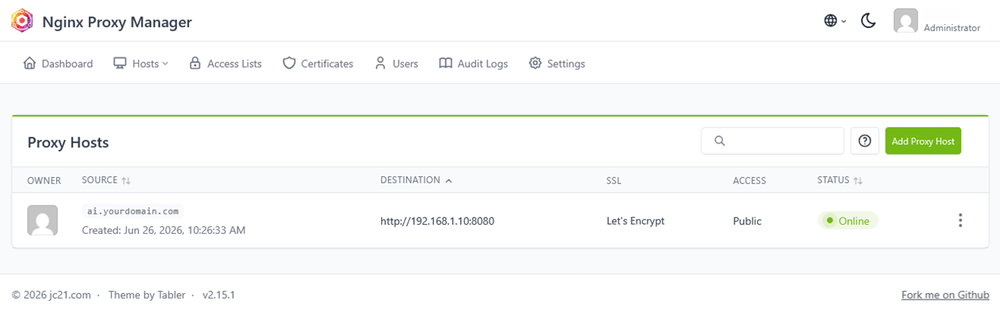

# Proxlio

**Reverse proxy + DNS + tunnel for your homelab, in one command.**


---

You have services running on a home server or Raspberry Pi. You want `ai.yourdomain.com` with valid SSL, reachable from anywhere — without opening ports on your router. Getting there normally means configuring Nginx Proxy Manager, AdGuard Home, and a Cloudflare Tunnel separately, each with its own quirks and documentation. Proxlio wires all three together. One command, five minutes.

```
Internet ──► [ Cloudflare Tunnel ] ──► [ Nginx Proxy Manager ] ──► your services
                                                  ▲
   LAN ──► [ AdGuard DNS ] ───────────────────────┘
             returns server's LAN IP
             (traffic never leaves your network)
```

## Features

✅ Single-command install — NPM, AdGuard Home, and cloudflared, all configured  
✅ Automatic SSL — Let's Encrypt certificates issued by NPM, no certbot setup  
✅ Split DNS — local traffic resolves to your server's LAN IP, stays off the internet  
✅ External access without port forwarding — Cloudflare Tunnel is outbound-only  
✅ Works even without a public IP — including CGNAT (when your ISP shares one IP across many customers) and DS-Lite  
✅ Add a service in under 2 minutes — 3 prompts, one script  
✅ No lock-in — plain Docker Compose, swap or extend components freely  

## Quick start

```bash
curl -fsSL https://raw.githubusercontent.com/proxlio/proxlio/main/install.sh | bash
```


The installer prompts for four values, then brings the stack up:

```
Domain (e.g. yourdomain.com):     yourdomain.com
Let's Encrypt email:              you@example.com
Cloudflare API token:             ••••••••••••••••••••••••••••••••••••••••
Tunnel name (e.g. home-tunnel):   home-tunnel

[*] Checking dependencies...
[+] Docker found
[*] Creating Cloudflare Tunnel: home-tunnel
[*] Writing .env and docker-compose.yml...
[*] Starting stack...
[+] Done.

   NPM Admin UI  →  http://localhost:81        admin@example.com / changeme
   AdGuard Home  →  http://192.168.1.x:3000   set on first access

   NPM admin is bound to localhost (security). From another device:
     ssh -L 8181:localhost:81 user@192.168.1.x  →  http://localhost:8181

Change the NPM default password immediately after first login.
```

## Add your first service

From the Proxlio install directory:

```bash
./scripts/add-service.sh
```

```
Service name (e.g. homeassistant): open-webui
IP:Port of the service            : 192.168.1.x:3000
Subdomain (e.g. hass)             : ai

[+] Proxy host created in NPM
[+] SSL certificate requested (Let's Encrypt)
[+] DNS rewrite added in AdGuard: ai.yourdomain.com → 192.168.1.x

✓  https://ai.yourdomain.com → 192.168.1.x:3000
```

What the script does:
- Creates a proxy host in Nginx Proxy Manager
- Requests a Let's Encrypt certificate for the subdomain
- Adds a DNS rewrite in AdGuard so LAN devices resolve `ai.yourdomain.com` to your server's local IP

**One manual step:** add the public hostname in your [Cloudflare Tunnel dashboard](https://one.dash.cloudflare.com/) — `ai.yourdomain.com` → `http://npm` (the NPM service name on the shared Docker network — not `localhost`). Automatic tunnel hostname creation via API is on the roadmap.



## Why not just configure them separately?

You can. Here's what that looks like:

| Task | Manual setup | Proxlio |
|------|-------------|---------|
| Install NPM + AdGuard + cloudflared | 3 separate Docker setups, port conflict debugging | One command |
| Connect them to work together | Trial and error across 3 docs | Pre-configured |
| Add a service with SSL | 4 clicks in NPM + 2 in AdGuard + DNS propagation wait | One script, 3 prompts |
| Reproduce on a new machine | Start from scratch | Re-run `install.sh` |
| Split DNS (LAN stays local) | Easy to get wrong, hard to debug | Automatic |

Proxlio is not magic — it is the same tools, pre-wired so they actually talk to each other out of the box.

## Requirements

- Linux — Raspberry Pi OS, Debian, or Ubuntu (64-bit)
- A domain managed on Cloudflare DNS (free account works)
- A Cloudflare API token — permissions: **Zone:Read** + **Cloudflare Tunnel:Edit**  
  → [Create API token](https://dash.cloudflare.com/profile/api-tokens)
- `jq` — required by `add-service.sh` (the installer will prompt you if missing: `sudo apt-get install -y jq`)

Docker is installed automatically if not already present.

> **Don't have a domain yet?** [Cloudflare Registrar](https://www.cloudflare.com/products/registrar/) offers domains at cost (no markup), already managed on Cloudflare DNS.

## What's inside

| Component | Role |
|-----------|------|
| [Nginx Proxy Manager](https://nginxproxymanager.com) | Routes HTTPS requests by hostname. Issues and renews Let's Encrypt certificates. Handles HTTP → HTTPS redirect. |
| [AdGuard Home](https://adguard.com/en/adguard-home/overview.html) | Local DNS server. Rewrites `subdomain.yourdomain.com` to your server's LAN IP so traffic never leaves your home network. Blocks ads as a side effect. |
| [cloudflared](https://developers.cloudflare.com/cloudflare-one/connections/connect-networks/) | Outbound-only tunnel to Cloudflare's edge. No port forwarding, no public IP required. |

## Architecture

```
                          YOUR HOME SERVER
  ┌────────────────────────────────────────────────────────────────┐
  │                                                                │
  │   ┌─────────────┐     ┌──────────────────┐    ┌────────────┐  │
  │   │  cloudflared│────►│ Nginx Proxy Mgr  │───►│  services  │  │
  │   │  (outbound  │     │ ports 80/443     │    │            │  │
  │   │   tunnel)   │     │ SSL termination  │    │ HA  :8123  │  │
  │   └─────────────┘     └──────────────────┘    │ n8n :5678  │  │
  │          ▲                      ▲             │ ...        │  │
  │          │                      │             └────────────┘  │
  │   ┌──────────────┐              │                             │
  │   │ AdGuard Home │              │                             │
  │   │  port 53     │              │ (LAN requests route here)  │
  │   │  DNS rewrites│──────────────┘                             │
  │   └──────────────┘                                            │
  └──────────────────────────────────────┬────────────────────────┘
                                         │
              ┌──────────────────────────┴──────────────────────┐
              │                                                  │
       FROM INTERNET                                    FROM YOUR LAN
              │                                                  │
     Cloudflare resolves                          Device queries AdGuard
     domain to Cloudflare IP                      gets back LAN IP of server
     → tunnel → NPM → service                     → NPM directly → service
                                                  (traffic stays local)
```

## Roadmap

- [x] Docker Compose stack — NPM + AdGuard Home + cloudflared
- [x] Single-command installer with interactive prompts
- [x] `add-service.sh` — proxy host + DNS rewrite + SSL in one script
- [ ] Automatic Cloudflare Tunnel hostname creation via API (removes the manual dashboard step)
- [ ] LAN service auto-discovery — scan open ports, propose exposing detected services
- [ ] Web setup wizard — guided initial configuration without touching config files
- [ ] Config backup and restore
- [ ] Multi-domain support

## Known limitations

- **Single server only** — Proxlio manages one host. Multi-server setups are not supported.
- **Cloudflare required** — the tunnel component only works with Cloudflare. No alternative tunnel providers yet.
- **Manual tunnel hostname step** — after running `add-service.sh`, you still need to add the public hostname in the Cloudflare dashboard. This is on the roadmap.
- **Port 53 conflict** — if `systemd-resolved` is running (default on Ubuntu), the installer will warn you and provide the commands to free the port. AdGuard needs exclusive access to port 53.
- **No HTTPS between NPM and backend** — NPM forwards to backend services over HTTP by default. You can change this per-host in NPM's UI if your service requires it.
- **Static IP or DHCP reservation recommended** — Proxlio captures your server's LAN IP at install time and stores it in `.env`. If your server's IP changes (DHCP lease renewal, interface switch), DNS rewrites will point to the old address until you update `HOST_IP` in `.env` and re-run `add-service.sh` for each service. A static IP or a router DHCP reservation avoids this.
- **No clustering or high availability** — this is a single-node setup. If your server goes down, services go down.

## Uninstall

```bash
# Remove containers and all data (proxy config, DNS config, certificates)
docker compose down -v

# Remove containers only, keep data volumes
docker compose down
```

## Alternative install (git clone)

If you prefer to inspect the code before running it:

```bash
git clone https://github.com/proxlio/proxlio
cd proxlio
cp .env.example .env   # fill in your values
bash install.sh
```

## Contributing

Open an issue before sending a PR — helps avoid duplicate effort and keeps things moving. Bug reports with a clear reproduction case are always useful. See [CONTRIBUTING.md](CONTRIBUTING.md) for the full guide.

## License

MIT — see [LICENSE](LICENSE).
